<style>
img[alt~="center"] {
  display: block;
  margin: 0 auto;
}
</style>

# <!-- fit --> Text Classification using GPT-2

<br/><br/>

**George Mihaila**

*PhD Candidate Computer Science*
*University of North Texas*

<br/>

---
# Disclaimer

- This is not your average tutorial on GPT-2! I will not focus on the original purpose of GPT-2 - text generation.
- In this tutorial we'll use GPT-2 in a less conventional way - for text classification.

---
# Agenda

* Intro
  * Understanding Natural Language Processing
  * Word embeddings
* Text Classification
* The Transformer
* GPT-2
  * Architecture
  * Inner Workings
  * Prediction
  * Classification
* Coding Session
* Conclusions

<br>


---

# Intro

## Wikipedia

**Natural language processing (NLP)** is a subfield of linguistics, computer science, and artificial intelligence **concerned with the interactions between computers and human language** ...

... The result is a computer capable of **"understanding"** the contents of documents, including the contextual nuances of the language within them.


---
# Understanding Natural Language Processing

---
# Understanding Natural Language Processing

```python
example = "I love cats! Cats are very funny."
```

---
# Understanding Natural Language Processing

```python
example = "I love cats! Cats are very funny."
```

```python
vocabulary = ['i', 'love', 'cats', 'are', 'funny']
```

---
# Understanding Natural Language Processing

```python
example = "I love cats! Cats are very funny."
```

```python
vocabulary = ['i', 'love', 'cats', 'are', 'funny']
```

```python
word_id = {'i': 0, 'love': 1, 'cats': 2, 'are': 3, 'funny': 4}
```

---
# Understanding Natural Language Processing

```python
example = "I love cats! Cats are very funny."
```

```python
vocabulary = ['i', 'love', 'cats', 'are', 'funny']
```

```python
word_id = {'i': 0, 'love': 1, 'cats': 2, 'are': 3, 'funny': 4}
```

Encode text into numbers.


---


# Word embeddings
---
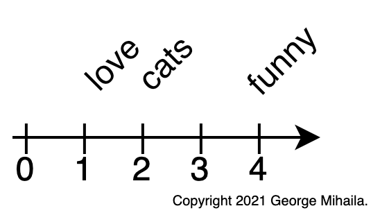

# Word embeddings

- Use numbers to represent words:
  ```python
  'love' : 1
  'cats' : 2
  'funny': 4
  ```

---


# Word embeddings
- Use numbers to represent words:
  ```python
  'love' : 1
  'cats' : 2
  'funny': 4
  ```

- User vectors instead of numbers

  ```python
  'love' : [0.90, 3.10]
  'cats' : [3.40, 3.20]
  'funny': [0.45, 1.88]
  ```

---


# Word embeddings
- Use numbers to represent words:
  ```python
  'love' : 1
  'cats' : 2
  'funny': 4
  ```

- User vectors instead of numbers
  ```python
  'love' : [0.90, 3.10]
  'cats' : [3.40, 3.20]
  'funny': [0.45, 1.88]
  ```

- **Word embeddings** are a type of word **representation** that allows words with similar meaning to have a similar representation.


---
# Text Classification

* Is the task of **assigning** a set of predefined categories to text data.
* Text classifiers can be used to **organize**, **structure**, and **categorize** any kind of text: *documents, medical studies ...*
* For example:
  * **new articles** can be organized by **topics**;
  * **support tickets** can be organized by **urgency**;
  * **movie reviews** can be organized by **sentiment**;


---
# Text Classification

## Movie reviews sentiment classification

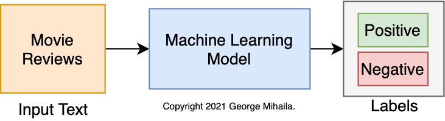


---
# The Transformer

* Is a **deep neural network architecture** for **transforming one sequence into another one** with the help of two parts (**Encoder** and **Decoder**).
* Was first introduced by Google in 2017 in the paper [Attention Is All You Need](https://arxiv.org/pdf/1706.03762.pdf).
* Is based solely on attention mechanisms.
* It brought ***"the biggest leap forward in the past five years, and one of the biggest leaps forward in the history of Search."*** for Google.

---
# The Transformer

- Is a **deep neural network architecture** for **transforming one sequence into another one** with the help of two parts (**Encoder** and **Decoder**).
* It can ***transform*** an article to a summary or translate english to another language, etc.

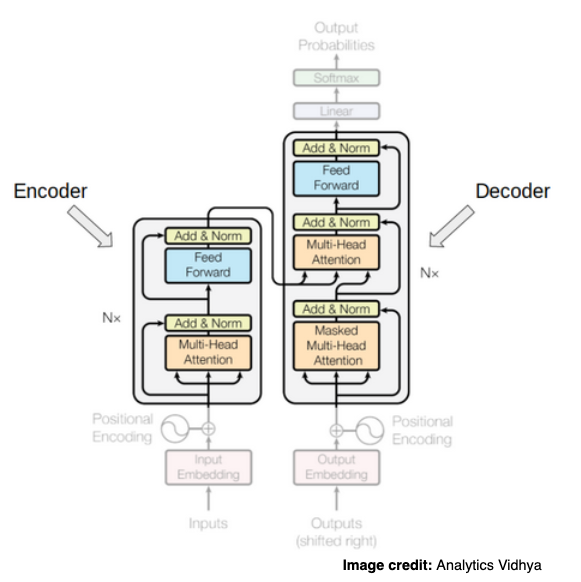

---
# The Transformer

- Is based solely on attention mechanisms.

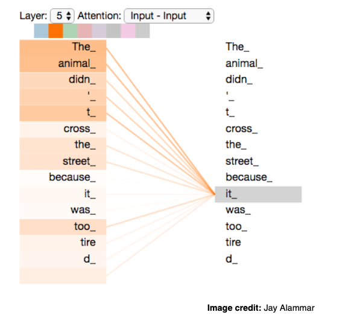

* **Disclaimer:**
  - I will not cover attention since this is not the intent of this tutorial.
  - [The Illustrated Transformer](http://jalammar.github.io/illustrated-transformer/) by [Jay Alammar](http://jalammar.github.io) is great resource!

---
# GPT-2
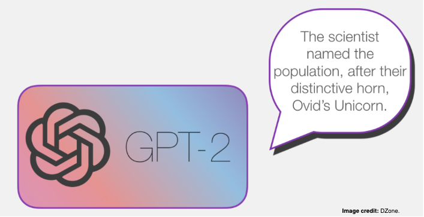


---
# GPT-2


## Wikipedia

**Generative Pre-trained Transformer 2 (GPT-2)** is an open-source artificial intelligence created by OpenAI in February 2019. GPT-2 **translates text, answers questions, summarizes passages, and generates text output** on a level that, while sometimes indistinguishable from that of humans, can become repetitive or nonsensical when generating long passages.


---
# Architecture


---
# Architecture

- We only have the decoder side of Transformer:


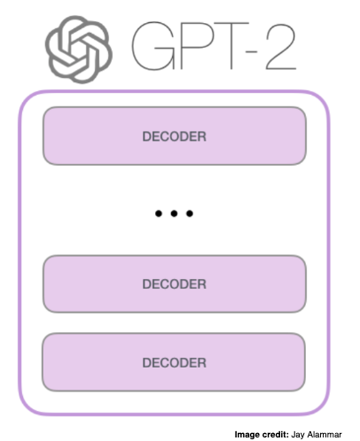


---
# Architecture

- There are multiple variations of GPT-2 depending on the number of decoder blocks:

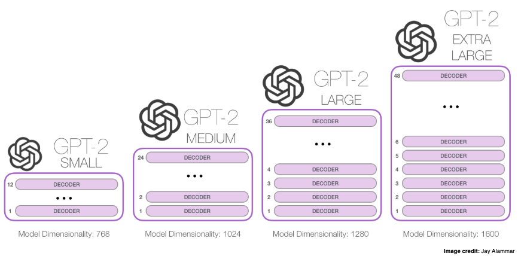


---
# Inner Workings

- [Detailed diagram](https://gmihaila.github.io/docs/markdown/activities/text_classification_using_gpt2_and_pytorch/gpt2_inner_workings.html)


---
# Prediction

## Wikipedia

GPT-2 **translates text, answers questions, summarizes passages, and generates text output**...

Let's see how it make predictions.


---
# Prediction

* We pass the text ***"a robot must"*** to GPT-2.
* GPT-2 will output word embeddings for each of the words.
* The last word embedding is used to predict the next word ***"obey"***.

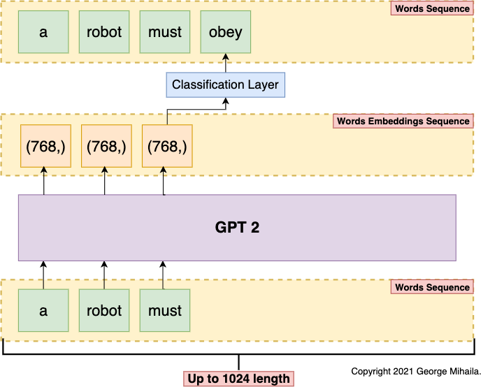

---
# Prediction

* Our new text ***"a robot must obey"*** is fed to GPT-2.
* Same process is repeated to predict the next word ***"orders"***.

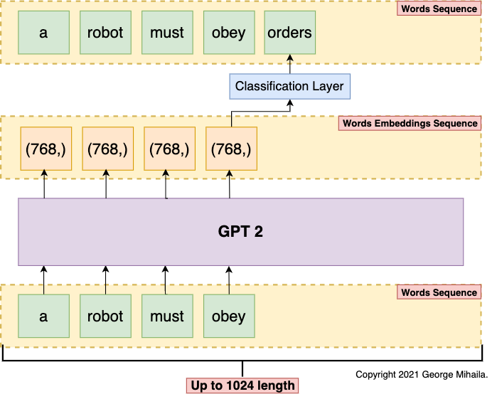


---
# Prediction

- This is how GPT-2 is able to **translates text, answers questions, summarizes passages, and generates text output**.
* **How can we use it for simple text classification?**


---
# Classification
* Now we'll use GPT-2 to perform text classification.

---
# Classification

- Now we'll use GPT-2 to perform text classification.

* We'll classify a movie review as being either positive or negative sentiment.

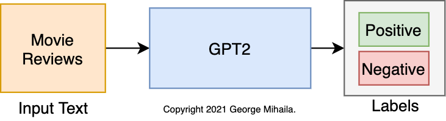

---
# Classification

- Let's look at a positive movie review:


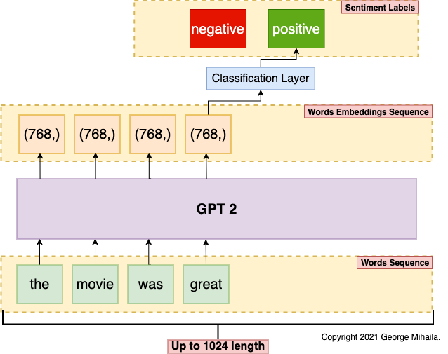

---
# Classification

- Now let's look at a negative movie review:

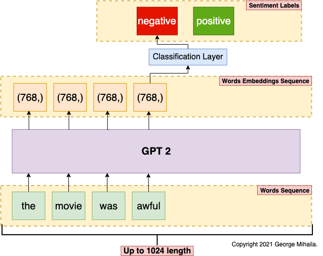


---
# Coding Session

## 🎱 GPT-2 For Text Classification using Hugging Face 🤗 Transformers

### Complete tutorial on how to use GPT-2 for text classification.

[](https://colab.research.google.com/github/gmihaila/ml_things/blob/master/notebooks/pytorch/gpt2_finetune_classification.ipynb) [](https://github.com/gmihaila/ml_things/blob/master/notebooks/pytorch/gpt2_finetune_classification.ipynb) [](https://www.dropbox.com/s/6t6kvlewoabwxqw/gpt2_finetune_classification.ipynb?dl=1) [](https://gmihaila.medium.com/gpt2-for-text-classification-using-hugging-face-transformers-574555451832) [](https://opensource.org/licenses/Apache-2.0)


- **Disclaimer:** *The format of this tutorial notebook is very similar to my other tutorial notebooks. This is done intentionally in order to keep readers familiar with my format.*

- This notebook is used to fine-tune GPT-2 model for text classification using [Huggingface](https://huggingface.co/transformers/) [transformers](https://github.com/huggingface/transformers) library on a custom dataset.

---
# Conclusions

* I showed that GPT-2 **can** be used for text classification.
* Depending on your data and classification task GPT-2 could outperform other transformers models.
* It's always good to have options.

---
# Contact 🎣

Let's stay in touch!


🦊 GitHub: [gmihaila](https://github.com/gmihaila)

🌐 Website: [gmihaila.github.io](https://gmihaila.github.io/)

👔 LinkedIn: [mihailageorge](https://www.linkedin.com/in/mihailageorge/)

📓 Medium: [@gmihaila](https://gmihaila.medium.com)

📬 Email: [georgemihaila@my.unt.edu.com](mailto:georgemihaila@my.unt.edu.com?subject=GitHub%20Website)

👤 Schedule meeting: [calendly.com/georgemihaila](https://calendly.com/georgemihaila)

---
# Resources

- [Text Classification](https://monkeylearn.com/text-classification/)
- [What is a transformer](https://medium.com/inside-machine-learning/what-is-a-transformer-d07dd1fbec04)
- [Google's Search Engine biggest leap](https://whatsnewinpublishing.com/google-has-made-one-of-the-biggest-leaps-forward-in-the-history-of-search-what-it-means-for-publishers/)
- [Understand transformers](https://www.analyticsvidhya.com/blog/2019/06/understanding-transformers-nlp-state-of-the-art-models/)
